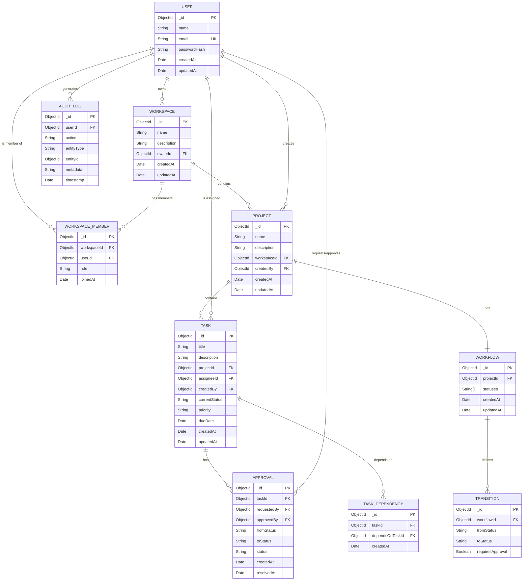

# ER Diagram — Axon

## Overview

This Entity-Relationship diagram defines the database schema for the Axon platform. The system uses **MongoDB** as its primary database, but the schema is modeled relationally to illustrate entity relationships clearly. Each entity maps to a MongoDB collection, with references (foreign keys) maintained via ObjectId fields.

---

## ER Diagram

---

## Entity Descriptions

| Entity             | Description                                                          | Collection Name     |
|--------------------|----------------------------------------------------------------------|---------------------|
| **User**           | Registered user with authentication credentials                     | `users`             |
| **Workspace**      | Top-level organizational unit; contains projects and members          | `workspaces`        |
| **WorkspaceMember** | Junction entity linking users to workspaces with role assignments    | `workspaceMembers`  |
| **Project**        | A project within a workspace; contains tasks and a workflow           | `projects`          |
| **Task**           | An actionable item within a project with status, priority, assignee   | `tasks`             |
| **Workflow**       | Defines the set of valid statuses for a project                       | `workflows`         |
| **Transition**     | Defines a valid status change within a workflow                       | `transitions`       |
| **Approval**       | Tracks approval requests for gated transitions                        | `approvals`         |
| **TaskDependency** | Defines a dependency relationship between two tasks                   | `taskDependencies`  |
| **AuditLog**       | Immutable record of a system action performed by a user               | `auditLogs`         |

---

## Key Relationships

| Relationship                        | Type         | Description                                                   |
|-------------------------------------|--------------|---------------------------------------------------------------|
| User → Workspace                    | One-to-Many  | A user can own multiple workspaces                            |
| Workspace → WorkspaceMember         | One-to-Many  | A workspace has multiple members                              |
| User → WorkspaceMember              | One-to-Many  | A user can be a member of multiple workspaces                 |
| Workspace → Project                 | One-to-Many  | A workspace contains multiple projects                        |
| Project → Task                      | One-to-Many  | A project contains multiple tasks                             |
| Project → Workflow                  | One-to-One   | Each project has exactly one workflow definition               |
| Workflow → Transition               | One-to-Many  | A workflow defines multiple valid transitions                  |
| Task → TaskDependency               | One-to-Many  | A task can have multiple dependencies                         |
| Task → Approval                     | One-to-Many  | A task can have multiple approval requests over its lifecycle  |
| User → AuditLog                     | One-to-Many  | Every user action generates audit log entries                  |

---

## Indexes (Recommended)

| Collection         | Index Fields                          | Type     | Purpose                           |
|--------------------|---------------------------------------|----------|------------------------------------|
| `users`            | `email`                               | Unique   | Fast login lookup                  |
| `workspaceMembers` | `workspaceId, userId`                 | Compound Unique | Prevent duplicate memberships |
| `tasks`            | `projectId`                           | Standard | Query tasks by project             |
| `tasks`            | `assigneeId`                          | Standard | Query tasks by assignee            |
| `tasks`            | `currentStatus`                       | Standard | Filter tasks by status             |
| `transitions`      | `workflowId, fromStatus, toStatus`    | Compound Unique | Prevent duplicate transitions |
| `taskDependencies` | `taskId, dependsOnTaskId`             | Compound Unique | Prevent duplicate dependencies|
| `auditLogs`        | `entityType, entityId`                | Compound | Query logs by entity               |
| `auditLogs`        | `userId`                              | Standard | Query logs by actor                |
| `auditLogs`        | `timestamp`                           | Standard | Time-range queries                 |
