# Class Diagram — Axon

## Overview

This class diagram represents the core domain model and service layer of the Axon platform. The design follows **Object-Oriented Programming (OOP) principles**:

- **Encapsulation**: Private attributes with controlled access via methods
- **Abstraction**: Service and repository interfaces hide implementation details
- **Inheritance**: `BaseRepository` provides shared data access logic; `BaseService` provides common service patterns
- **Polymorphism**: `NotificationService` can be extended with different notification strategies

---

## Class Diagram

```mermaid
classDiagram

    %% ──────────────────────────────────────────────
    %% Domain Models
    %% ──────────────────────────────────────────────

    class User {
        -String _id
        -String name
        -String email
        -String passwordHash
        -Date createdAt
        +getId() String
        +getName() String
        +getEmail() String
        +verifyPassword(password) Boolean
        +toJSON() Object
    }

    class Workspace {
        -String _id
        -String name
        -String description
        -String ownerId
        -Date createdAt
        +getId() String
        +getName() String
        +getOwnerId() String
        +isOwner(userId) Boolean
        +toJSON() Object
    }

    class WorkspaceMember {
        -String _id
        -String workspaceId
        -String userId
        -Role role
        +getRole() Role
        +canDo(action) Boolean
        +promoteToAdmin() void
        +demoteToMember() void
    }

    class Role {
        <<enumeration>>
        OWNER
        ADMIN
        MEMBER
        +canDo(action) Boolean
        +getPermissions() String[]
    }

    class Project {
        -String _id
        -String name
        -String description
        -String workspaceId
        -String createdBy
        -Date createdAt
        +getId() String
        +getName() String
        +getWorkspaceId() String
        +toJSON() Object
    }

    class Task {
        -String _id
        -String title
        -String description
        -String projectId
        -String assigneeId
        -String currentStatus
        -String priority
        -Date dueDate
        -Date createdAt
        -Date updatedAt
        +getId() String
        +getTitle() String
        +getStatus() String
        +getAssigneeId() String
        +getPriority() String
        +isOverdue() Boolean
        +toJSON() Object
    }

    class Workflow {
        -String _id
        -String projectId
        -String[] statuses
        -Transition[] transitions
        +getStatuses() String[]
        +addStatus(status) void
        +removeStatus(status) void
        +getTransitions() Transition[]
        +isValidTransition(from, to) Boolean
    }

    class Transition {
        -String _id
        -String fromStatus
        -String toStatus
        -Boolean requiresApproval
        +getFromStatus() String
        +getToStatus() String
        +needsApproval() Boolean
    }

    class Approval {
        -String _id
        -String taskId
        -String requestedBy
        -String approvedBy
        -String fromStatus
        -String toStatus
        -String status
        -Date createdAt
        -Date resolvedAt
        +getStatus() String
        +approve(approverId) void
        +reject(approverId) void
        +isPending() Boolean
    }

    class Dependency {
        -String _id
        -String taskId
        -String dependsOnTaskId
        +getTaskId() String
        +getDependsOnTaskId() String
    }

    class AuditLog {
        -String _id
        -String userId
        -String action
        -String entityType
        -String entityId
        -Object metadata
        -Date timestamp
        +getUserId() String
        +getAction() String
        +getEntityType() String
        +getTimestamp() Date
        +toJSON() Object
    }

    %% ──────────────────────────────────────────────
    %% Abstract Base Classes
    %% ──────────────────────────────────────────────

    class BaseRepository {
        <<abstract>>
        #Model model
        +findById(id) Document
        +findAll(filter) Document[]
        +create(data) Document
        +update(id, data) Document
        +delete(id) Boolean
    }

    class BaseService {
        <<abstract>>
        #Repository repository
        +getById(id) Object
        +getAll(filter) Object[]
    }

    %% ──────────────────────────────────────────────
    %% Repositories (inherit from BaseRepository)
    %% ──────────────────────────────────────────────

    class TaskRepository {
        +findByProject(projectId) Task[]
        +findByAssignee(userId) Task[]
        +updateStatus(taskId, status) Task
        +findWithDependencies(taskId) Task
    }

    class UserRepository {
        +findByEmail(email) User
        +existsByEmail(email) Boolean
    }

    class AuditLogRepository {
        +findByEntity(entityType, entityId) AuditLog[]
        +findByUser(userId) AuditLog[]
        +findByDateRange(start, end) AuditLog[]
    }

    %% ──────────────────────────────────────────────
    %% Services (inherit from BaseService)
    %% ──────────────────────────────────────────────

    class TaskService {
        -TaskRepository taskRepository
        -WorkflowEngine workflowEngine
        -ApprovalService approvalService
        -DependencyService dependencyService
        -AuditLogService auditLogService
        +createTask(taskData, userId) Task
        +assignUser(taskId, userId) Task
        +changeStatus(taskId, newStatus, userId) Task
        +getTasksByProject(projectId) Task[]
        +deleteTask(taskId, userId) Boolean
    }

    class WorkflowEngine {
        -WorkflowRepository workflowRepository
        +validateTransition(from, to, projectId) Boolean
        +requiresApproval(from, to) Boolean
        +getAvailableTransitions(currentStatus, projectId) String[]
        +createWorkflow(projectId, statuses, transitions) Workflow
    }

    class ApprovalService {
        -ApprovalRepository approvalRepository
        -AuditLogService auditLogService
        +createApprovalRequest(taskId, userId, toStatus) Approval
        +approveTask(approvalId, approverId) Approval
        +rejectTask(approvalId, approverId) Approval
        +getPendingApprovals(projectId) Approval[]
    }

    class DependencyService {
        -DependencyRepository dependencyRepository
        +addDependency(taskId, dependsOnTaskId) Dependency
        +removeDependency(dependencyId) Boolean
        +checkDependenciesResolved(taskId) Boolean
        +detectCircularDependency(taskId, dependsOnTaskId) Boolean
        +computeCriticalPath(projectId) Task[]
    }

    class AuditLogService {
        -AuditLogRepository auditLogRepository
        +logAction(action, userId, entityType, entityId, metadata) AuditLog
        +getLogsByEntity(entityType, entityId) AuditLog[]
        +getLogsByUser(userId) AuditLog[]
    }

    class NotificationService {
        +notify(userId, message, type) void
        +getNotifications(userId) Notification[]
        +markAsRead(notificationId) void
    }

    %% ──────────────────────────────────────────────
    %% Inheritance Relationships
    %% ──────────────────────────────────────────────

    BaseRepository <|-- TaskRepository
    BaseRepository <|-- UserRepository
    BaseRepository <|-- AuditLogRepository

    BaseService <|-- TaskService
    BaseService <|-- AuditLogService

    %% ──────────────────────────────────────────────
    %% Associations
    %% ──────────────────────────────────────────────

    User "1" --> "*" WorkspaceMember : has memberships
    Workspace "1" --> "*" WorkspaceMember : has members
    Workspace "1" --> "*" Project : contains
    Project "1" --> "*" Task : contains
    Project "1" --> "1" Workflow : has
    Workflow "1" --> "*" Transition : defines
    Task "1" --> "*" Dependency : has dependencies
    Task "1" --> "*" Approval : has approvals
    User "1" --> "*" AuditLog : generates

    WorkspaceMember --> Role : has

    %% ──────────────────────────────────────────────
    %% Service Dependencies
    %% ──────────────────────────────────────────────

    TaskService --> TaskRepository : uses
    TaskService --> WorkflowEngine : uses
    TaskService --> ApprovalService : uses
    TaskService --> DependencyService : uses
    TaskService --> AuditLogService : uses
    TaskService --> NotificationService : uses
    AuditLogService --> AuditLogRepository : uses
```

---

## Design Principles Applied

| Principle        | Application in Axon                                                          |
|------------------|------------------------------------------------------------------------------|
| **Encapsulation**   | All model attributes are private (`-`), accessed via getter methods       |
| **Abstraction**     | `BaseRepository` and `BaseService` abstract common operations             |
| **Inheritance**     | `TaskRepository` extends `BaseRepository`; `TaskService` extends `BaseService` |
| **Polymorphism**    | `role.canDo(action)` behaves differently based on the role type (Owner/Admin/Member) |
| **SRP**             | Each service handles a single domain concern                              |
| **DIP**             | Services depend on repository abstractions, not concrete database drivers |
