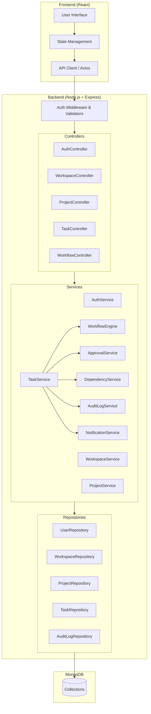

# Axon — Smart Project Management Platform

## Project Title

**Axon** — A Workflow-Driven Smart Project Management Platform

---

## Project Description

Axon is a full-stack project management system designed to go beyond simple task tracking. It provides teams with **custom workflow engines**, **approval-based task transitions**, **task dependency management**, and **role-based access control (RBAC)** — all backed by a clean, enterprise-grade backend architecture.

Built using the **Controller → Service → Repository** pattern, Axon emphasizes clean separation of concerns, scalability, and maintainability. The system is designed to simulate real-world software engineering workflows where tasks move through defined lifecycle states, approvals gate critical transitions, and every action is audited for traceability.

---

## Problem Statement

Most project management tools available today either:

- Provide only basic task lists without workflow enforcement.
- Lack approval mechanisms for critical state transitions.
- Do not support task dependency tracking or critical path analysis.
- Offer no audit trail for accountability and compliance.

Teams working on complex projects need a system that enforces **process discipline** — ensuring tasks follow defined workflows, dependencies are respected, and actions are traceable.

**Axon solves this** by combining workflow automation, dependency management, and audit logging into a single, cohesive platform.

---

## Objectives

1. Build a role-based multi-user project management system.
2. Implement a **custom workflow engine** that allows users to define task lifecycle states and valid transitions.
3. Support **approval-based task transitions** where designated approvers must authorize state changes.
4. Implement a **task dependency system** with circular dependency detection and critical path computation.
5. Record all significant actions in an **audit log** for traceability.
6. Follow **Clean Architecture** principles with clear separation between controllers, services, and repositories.
7. Apply **OOP design principles** (encapsulation, abstraction, inheritance, polymorphism) throughout the backend.

---

## Scope of the System

### In Scope

| Module                  | Description                                                  |
|-------------------------|--------------------------------------------------------------|
| Authentication          | JWT-based user registration, login, and session management   |
| Workspace Management    | Create and manage workspaces with role-based membership       |
| Project Management      | Create, update, and organize projects within workspaces       |
| Task Management         | Full CRUD with assignment, status tracking, and filtering     |
| Workflow Engine         | Custom status definitions and valid transition rules          |
| Approval System         | Gate specific transitions behind user approvals               |
| Dependency Graph Engine | Define task dependencies, detect cycles, compute critical path|
| Audit Logging           | Immutable log of all significant system actions               |
| Notifications (Basic)   | In-app notification triggers for key events                   |

### Out of Scope

- Real-time collaboration (WebSockets)
- File attachments and media management
- Third-party integrations (Slack, GitHub, etc.)
- Advanced analytics and reporting dashboards
- Mobile application

---

## Key Features

### 1. Role-Based Access Control (RBAC)

- Three roles: **Owner**, **Admin**, **Member**
- Permissions enforced via `role.canDo(action)` pattern
- Granular control over who can create projects, assign tasks, approve transitions, and view audit logs

### 2. Custom Workflow Engine

- Users define custom statuses per project (e.g., `Draft → Review → Approved → Done`)
- Valid transitions are explicitly configured
- Invalid transitions are rejected by the engine
- Workflow state is enforced at the service layer

### 3. Approval-Based Task Workflow

- Specific transitions can be flagged as **requiring approval**
- Designated approvers must authorize the transition before it takes effect
- Approval requests are tracked with status: `Pending`, `Approved`, `Rejected`

### 4. Task Dependency System

- Tasks can declare dependencies on other tasks
- The system performs **circular dependency detection** using graph traversal (DFS)
- **Critical path computation** identifies the longest chain of dependent tasks
- Blocked tasks cannot transition until their dependencies are resolved

### 5. Audit Logging System

- Every significant action is recorded with:
  - Actor (who performed the action)
  - Action type (e.g., `TASK_CREATED`, `STATUS_CHANGED`, `APPROVAL_GRANTED`)
  - Target entity and metadata
  - Timestamp
- Logs are **immutable** — append-only, no updates or deletes

---

## Unique Differentiators

| Feature                  | Typical Task Managers | Axon                          |
|--------------------------|-----------------------|-------------------------------|
| Custom Workflows         | ❌ Fixed statuses     | ✅ User-defined states         |
| Approval Gates           | ❌ Not supported      | ✅ Configurable per transition |
| Dependency Graph         | ❌ Basic or none      | ✅ With cycle detection        |
| Critical Path Analysis   | ❌ Not available      | ✅ Graph-based computation     |
| Audit Logging            | ❌ Minimal            | ✅ Comprehensive & immutable   |
| Clean Architecture       | ❌ Monolithic         | ✅ Controller → Service → Repo |
| OOP Design Principles    | ❌ Procedural         | ✅ Encapsulation & Polymorphism|

---

## Technology Stack

| Layer          | Technology                          |
|----------------|-------------------------------------|
| **Frontend**   | React (with React Router)           |
| **Backend**    | Node.js + Express.js                |
| **Database**   | MongoDB (with Mongoose ODM)         |
| **Auth**       | JSON Web Tokens (JWT)               |
| **Architecture** | Clean Architecture (Controller → Service → Repository) |
| **Design**     | OOP Principles (Encapsulation, Abstraction, Inheritance, Polymorphism) |
| **API Style**  | RESTful API                         |
| **Validation** | Express Validator / Joi             |
| **Testing**    | Jest (Unit & Integration)           |

---

## System Architecture Overview

---

## Future Enhancements

1. **Real-Time Collaboration** — WebSocket-based live updates for task changes and notifications.
2. **Kanban Board View** — Drag-and-drop visual board mapped to workflow statuses.
3. **Sprint Management** — Time-boxed iteration planning with velocity tracking.
4. **Advanced Analytics** — Charts for task completion rates, bottleneck identification, and team productivity.
5. **Third-Party Integrations** — Connect with GitHub, Slack, and CI/CD pipelines for automated workflow triggers.
6. **Role Customization** — Allow workspace owners to define custom roles with fine-grained permissions.
7. **Email Notifications** — Extend the notification system to send email alerts for critical events.
8. **Export & Reporting** — Generate PDF/CSV reports of project status, audit logs, and dependency graphs.
