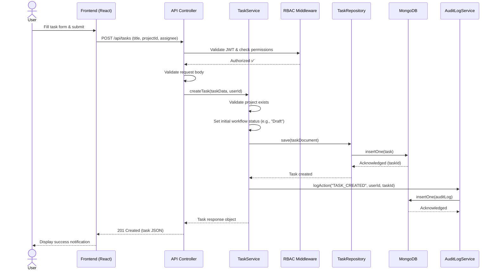
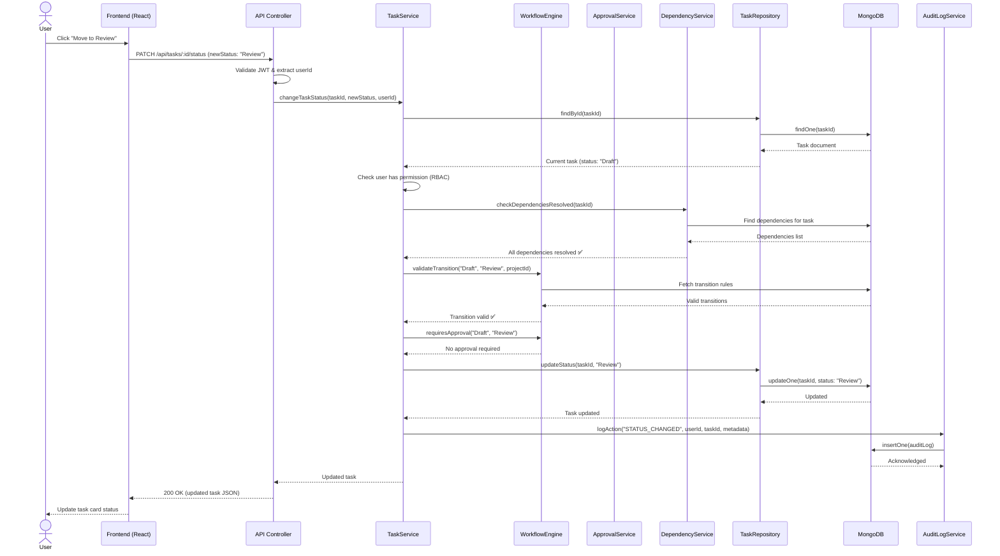
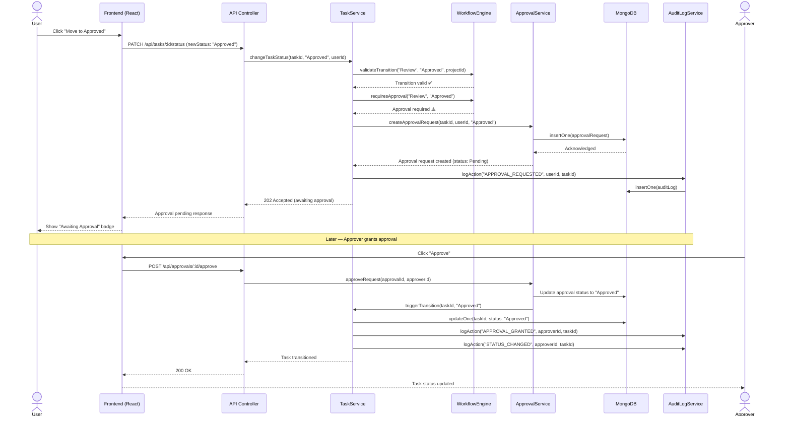

# Sequence Diagram — Task Creation & Workflow Transition

## Overview

This sequence diagram illustrates the end-to-end flow when a user creates a task and subsequently transitions it to the next workflow state. The flow demonstrates the interaction between all architectural layers following the **Controller → Service → Repository** pattern, including permission checks, workflow validation, and audit logging.

---

## Flow 1: Task Creation

---

## Flow 2: Workflow State Transition

---

## Flow 3: Transition Requiring Approval

---

## Key Observations

| Step                     | Layer            | Responsibility                                      |
|--------------------------|------------------|-----------------------------------------------------|
| Request validation       | Controller       | Schema validation, JWT extraction                   |
| Permission check         | Service / RBAC   | Role-based authorization via `role.canDo(action)`   |
| Dependency verification  | DependencyService| Ensure all blocking tasks are resolved              |
| Workflow validation      | WorkflowEngine   | Verify the transition is defined and valid           |
| Approval gating          | ApprovalService  | Create approval request if transition requires it   |
| Data persistence         | Repository       | Database operations abstracted from business logic  |
| Audit trail              | AuditLogService  | Immutable record of every significant action        |
