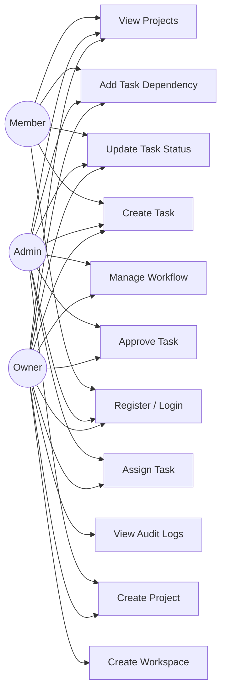

# Use Case Diagram — Axon

## Overview

This use case diagram illustrates the interactions between the three primary actors (**Owner**, **Admin**, **Member**) and the core functionalities of the Axon platform. Each actor inherits capabilities from the roles below it — Members have base access, Admins extend Member capabilities, and Owners have full system control.

---

## Actor Hierarchy

| Actor    | Inherits From | Description                                      |
|----------|---------------|--------------------------------------------------|
| Member   | —             | Base user with task and project access            |
| Admin    | Member        | Extended permissions for workflow and user mgmt   |
| Owner    | Admin         | Full control including workspace and audit access |

---

## Use Case Diagram

---

## Use Case Descriptions

| # | Use Case             | Description                                                        | Actors               |
|---|----------------------|--------------------------------------------------------------------|-----------------------|
| 1 | Register / Login     | User creates an account or authenticates via JWT                   | Owner, Admin, Member  |
| 2 | Create Workspace     | Create a new workspace and become its owner                        | Owner                 |
| 3 | Create Project       | Create a project within a workspace                                | Owner, Admin          |
| 4 | Create Task          | Create a task within a project                                     | Owner, Admin, Member  |
| 5 | Assign Task          | Assign a task to a workspace member                                | Owner, Admin          |
| 6 | Update Task Status   | Transition a task to the next workflow state                       | Owner, Admin, Member  |
| 7 | Approve Task         | Approve or reject a pending task transition                        | Owner, Admin          |
| 8 | Manage Workflow      | Define custom statuses and valid transitions for a project         | Owner, Admin          |
| 9 | View Audit Logs      | View the immutable log of all system actions                       | Owner                 |
|10 | Add Task Dependency  | Define dependency relationships between tasks                      | Owner, Admin, Member  |
|11 | View Projects        | Browse and view project details and associated tasks               | Owner, Admin, Member  |

---

## Access Control Matrix

| Use Case             | Owner | Admin | Member |
|----------------------|:-----:|:-----:|:------:|
| Register / Login     |  ✅   |  ✅   |  ✅    |
| Create Workspace     |  ✅   |  ❌   |  ❌    |
| Create Project       |  ✅   |  ✅   |  ❌    |
| Create Task          |  ✅   |  ✅   |  ✅    |
| Assign Task          |  ✅   |  ✅   |  ❌    |
| Update Task Status   |  ✅   |  ✅   |  ✅    |
| Approve Task         |  ✅   |  ✅   |  ❌    |
| Manage Workflow      |  ✅   |  ✅   |  ❌    |
| View Audit Logs      |  ✅   |  ❌   |  ❌    |
| Add Task Dependency  |  ✅   |  ✅   |  ✅    |
| View Projects        |  ✅   |  ✅   |  ✅    |
